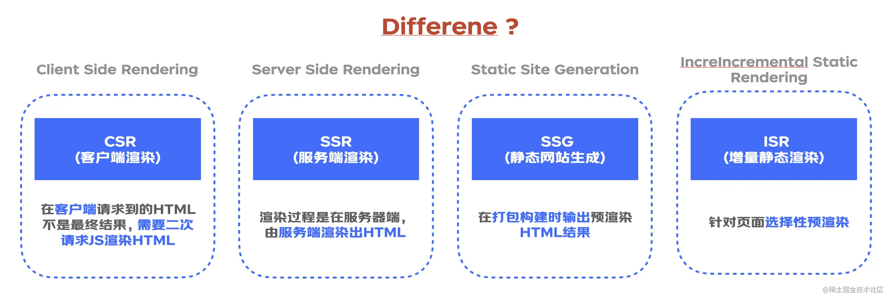

参考链接：[【NextJS】一文了解 NextJS 并对性能优化做出最佳实践 - 掘金 (juejin.cn)](https://juejin.cn/post/7154205903388934180#comment)

# 4种渲染方式

- **Client Side Rendering (CSR)**
  客户端渲染，往往是一个 SPA(单页面应用)，HTML文件仅包含JS\CSS资源，不涉及页面内容，页面内容需要浏览器解析JS后二次渲染。
- **Static Site Generation (SSG)**
  静态页面生成，对于不需要频繁更新的静态页面内容，适合SSR，不依赖服务端。
- **Server Side Rendering (SSR)**
  服务端渲染，对于需要频繁更新的静态页面内容，更适合使用SSR，依赖服务端。
- **IncreIncremental Site Rendering (ISR)**
  增量静态生成，基于页面内容的缓存机制，仅对未缓存过的静态页面进行增量式生成，依赖服务端。

> SSG / ISR 都是非常适合博客类应用的，**区别**在于SSG是构建时生成，效率较低，ISR是基于已有的缓存按需生成，效率更高。



# 性能分析工具

如何看性能？【打开`开发者调试工具`】

1. 网络
2. 性能
3. Lighthouse

# 优化

1. **将不可见元素动态导入**

```typescript
const AddModal = dynamic(() => import("@/components/add-customer-modal"))
const DetailModel = dynamic(() => import("@/components/detail-customer-modal"))
const Load = dynamic(() => import("@/util/load-animation"))
```

打开Network。当条件满足时，你将看到一个新的网络请求被发出来获取动态组件(单击按钮打开一个模态)。

2. **next/script 优化 script 加载时**

| strategy          | 描述                 |
| ----------------- | -------------------- |
| beforeInteractive | 可交互前加载脚本     |
| afterInteractive  | 可交互后加载脚本     |
| lazyOnload        | 浏览器空闲时加载脚本 |

```typescript
<script strategy="lazyOnload" src="//wl.jd.com/boomerang.min.js" />
```


