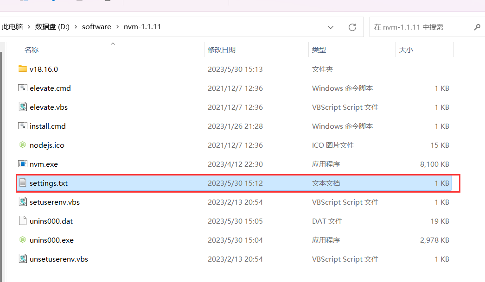
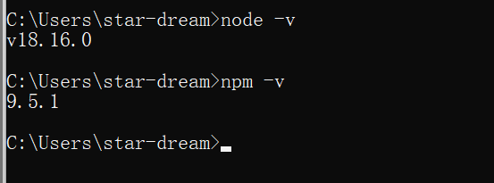

# nvm 安装

首先卸载 nodejs

- 控制面板删除
- 环境变量删除
- 安装目录删除（`where node`）
- 家目录有关 nodejs 删除
- %AppData% 文件夹里面 nodejs 删除

先去 github 下载 nvm

双击可执行文件 nvm-setup.exe

## 打开 nvm 安装目录



打开 settings.txt 文件，加入以下信息：

```txt
root: D:\software\nvm-1.1.11
path: D:\Program Files\nodejs
node_mirror: https://npmmirror.com/mirrors/node/
npm_mirror: https://registry.npmmirror.com/binary.html?path=npm/
```

在 cmd 中安装 nodejs 

```sh
nvm install lts
```

在 cmd 中使用 nodejs

```sh
nvm use ${版本号}
```

查看版本，是否安装完成

